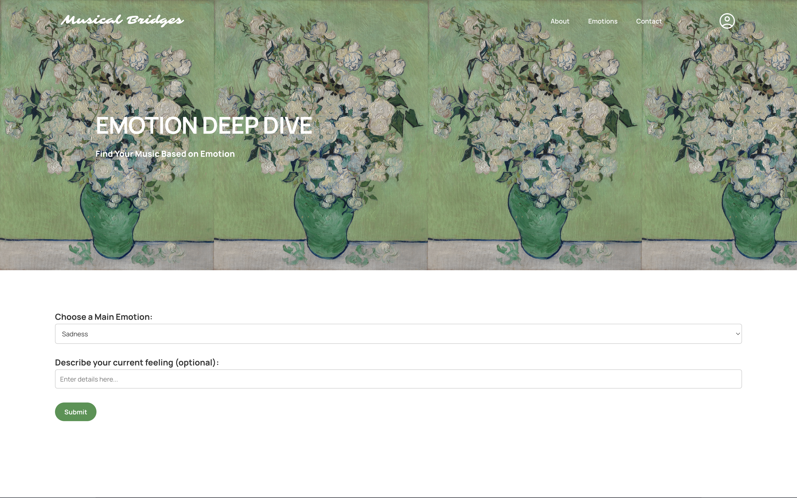
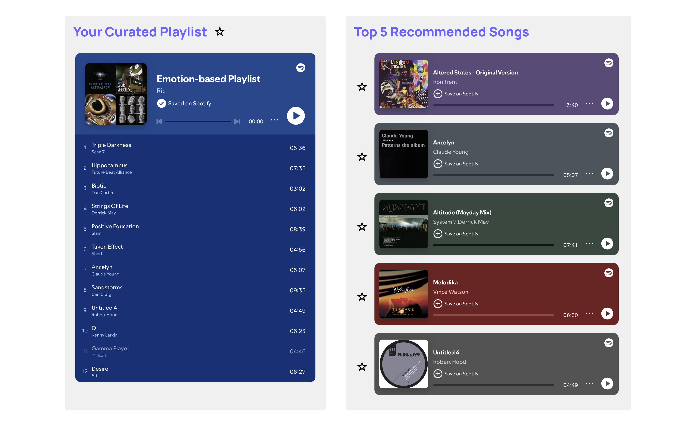

# Musical Bridges: An Emotion-Driven Music Recommendation System


**Abstract**  
Musical Bridges is an innovative web application designed to help users navigate and manage their emotions through personalized music recommendations. Leveraging Spotify's API and Kimi's natural language processing (NLP) capabilities, the system analyzes a user's self-described emotional state and generates tailored playlists from a refined taxonomy of 30+ emotions—inspired by Charles Darwin's foundational work on emotional expression. This paper details the system architecture, emotion identification methodology, playlist generation algorithm, and strategies to mitigate filter bubble effects in music discovery.  

---

## 1. Introduction  

Existing music recommendation systems often rely on oversimplified emotional models (e.g., Ekman's 6 basic emotions) or generic genre-based classifications, failing to address nuanced emotional needs. Musical Bridges bridges this gap by:  
- **Expanding emotional granularity**: Incorporating 30+ emotions derived from Darwin's *The Expression of the Emotions in Man and Animals* (1872).  
- **Dynamic user input**: Allowing free-text descriptions of emotional states for precise NLP-based analysis.  
- **Diverse recommendations**: Combining audio features (e.g., valence, energy) with popularity metrics to balance familiarity and novelty.  

---

## 2. System Architecture  

The application follows a client-server model with the following components:  
```plaintext
Musical-Bridges/
├── Backend (Python/Flask): Emotion analysis, Spotify API interactions  
├── Frontend (HTML/JS): User input, playlist visualization  
├── AI Integration (Kimi): NLP-based emotion classification  
└── Database: Stores emotion-genre mappings and track metadata  
```  

Key dependencies:  
- **Spotify Web API**: For track search, audio feature extraction, and playlist generation.  
- **Kimi API**: To parse user-generated text into discrete emotional states.  

---

## 3. Emotion Identification  

### 3.1 Theoretical Foundation  
Darwin's work established that emotions are universal, biologically rooted, and expressed through consistent physical cues (e.g., facial expressions, posture). Musical Bridges adapts his taxonomy to modern affective computing by:  
- **Including compound emotions**: E.g., "Tender feelings" (a blend of love and calm) or "Dejection" (low-intensity sadness).  
- **Mapping emotions to physiological responses**: E.g., "Blushing" (linked to shyness/modesty) informs acoustic features like tempo (slower for self-conscious states).  

### 3.2 Implementation  
1. **User Input**: Free-text field (e.g., "I feel wistful but hopeful").  
2. **NLP Processing**: Kimi classifies input into one of 30+ predefined emotions using:  
   - **Keyword extraction**: Identifies emotion-associated terms (e.g., "heartbroken" → Grief).  
   - **Contextual analysis**: Detects mixed emotions (e.g., "nervous excitement" → Anxiety + High spirits).  
3. **Output**: A normalized emotion label fed into the playlist generator.  

*Example*:  
```  
User Input: "Overwhelmed at work but craving joy"  
→ Kimi Output: [Anxiety (60%), Joy (40%)]  
```  



---

## 4. Playlist Generation  

### 4.1 Track Selection Algorithm  
1. **Emotion-Genre Mapping**: Predefined associations (e.g., "Devotion" → Gospel, Soul; "Ill-temper" → Heavy Metal).  
2. **Spotify Search Query**: Filters tracks by:  
   - **Audio Features**:  
     - *Valence* (0–1): Positivity (high for Joy, low for Grief).  
     - *Energy* (0–1): Intensity (high for Anger, low for Dejection).  
     - *Danceability* (0–1): Rhythmic suitability.  
   - **Popularity**: Prioritizes tracks with broad appeal.  
3. **Curated Selection**: 10–20 tracks balancing:  
   - **Emotional congruence**: Matches the target emotion’s acoustic profile.  
   - **Diversity**: At least 3 genres per playlist to avoid homogeneity.  

### 4.2 Top 5 Recommendations  
- **Ranking Criteria**: Combines Spotify popularity scores and audio feature alignment.  
- **Embedding**: Spotify Web Playback SDK generates previewable widgets.  

*Example Output for "High Spirits"*:  
1. "Uptown Funk" – Mark Ronson (Pop/Funk)  
2. "Dancing Queen" – ABBA (Disco)  
3. "Happy" – Pharrell Williams (R&B)  
4. "Don’t Stop Me Now" – Queen (Rock)  
5. "Can’t Stop the Feeling!" – Justin Timberlake (Pop)  



---

## 5. Mitigating Filter Bubbles  

To counteract algorithmic over-specialization:  
- **Genre Injection**: Forces 20% of tracks from outside the user’s typical listening history.  
- **Temporal Shifting**: For recurring users, suggests "opposite" emotions (e.g., follow a "Grief" playlist with "Comfort" tracks).  
- **Exploratory Mode**: Optional "Surprise Me" feature introduces avant-garde or cross-cultural genres.  

---

## 6. Usage Instructions  
1. Visit [Musical Bridges](https://musical-bridges-063243932240.herokuapp.com/).  
2. Describe your emotion in free text (e.g., "Post-breakup melancholy").  
3. Receive a playlist + top 5 tracks with embedded Spotify players.  

---

## 7. Future Work  
- **Real-time Adaptation**: Adjust playlists based on user feedback (e.g., skipping tracks).  
- **Biometric Integration**: Use wearable data (heart rate, skin conductance) to refine emotion detection.  
- **Cultural Customization**: Localize emotion-genre mappings (e.g., "Pride" may link to marching bands in the US vs. traditional drums in West Africa).  

---

## 8. Conclusion  
By grounding its model in Darwin’s principles of emotional expression and leveraging modern NLP/ML tools, Musical Bridges offers a scientifically informed alternative to rigid emotion-music systems. Its emphasis on granularity and diversity addresses key limitations in current recommendation engines.  

**License**: MIT  
**Acknowledgements**: Spotify API team, Kimi NLP developers.  

---  
*"Music is the shorthand of emotion."* — Leo Tolstoy